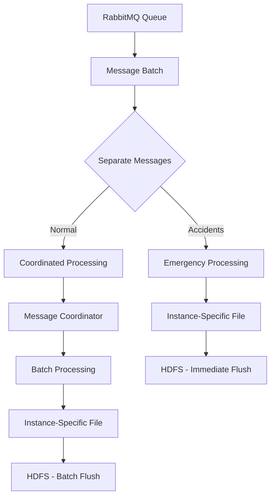

# HDFS Sink Optimization Plan

## 🎯 **Executive Summary**

The current HDFS sink has critical architectural flaws that cause incorrect partitioning, data corruption risks, and poor accident detection latency. This document outlines a comprehensive optimization plan to address these issues while maintaining multi-instance compatibility.

---

## 🚨 **Critical Issues Identified**

### **Issue 1: Incorrect Partitioning Logic**
**Problem**: All messages in a batch use the first message's partition
```java
// CURRENT BROKEN CODE (lines 218-220 in HdfsSink.java):
String firstMessage = batch.isEmpty() ? null : batch.get(0);
ensureWriterExists(firstMessage);

for (String message : batch) {
    writeMessage(message);  // ❌ ALL messages go to firstMessage's partition!
}
```

**Impact**: 
- Driver 400017's data ends up in driver 400016's HDFS partition
- External table queries return incorrect results
- Data integrity compromised

### **Issue 2: Multi-Instance File Collisions**
**Problem**: Multiple instances create files with identical names
```
Instance-1: Creates "telemetry-143052.parquet" for driver 400001
Instance-2: Creates "telemetry-143052.parquet" for driver 400001
Result: File corruption in HDFS
```

**Current Setup**: Scenario 2 (Multiple Instances Reading Same Queue)
```yaml
# From telemetry-streams.yml:
destination: "telematics_exchange"
group: "hdfs-sink-group"
exchangeType: "fanout"
```

### **Issue 3: Accident Detection Latency**
**Problem**: Accidents processed with same priority as normal telemetry
- Current: 10-second batch timeout
- Required: <1 second for emergency response

---

## 🚀 **Proposed Solution: Option 6+ Enhanced**

### **Architecture Overview**



### **Core Principles**

1. **Message-Level Partitioning**: Each message routes to correct partition
2. **Priority Processing**: Accidents bypass normal queuing
3. **Instance Isolation**: Unique file names prevent collisions
4. **Coordinated Normal Processing**: Reduce file fragmentation

---

## 📋 **Implementation Plan**

### **Phase 1: Core Partitioning Fix** 
**Priority**: CRITICAL
**Time**: 2-3 hours

#### **Changes Required**:

1. **Update `processBatch()` method**:
```java
private void processBatch() {
    List<String> batch = new ArrayList<>();
    messageQueue.drainTo(batch, batchSize);
    
    // Separate accidents from normal messages
    Map<Boolean, List<String>> messagesByType = batch.stream()
        .collect(partitioningBy(this::isAccidentMessage));
    
    List<String> accidents = messagesByType.get(true);
    List<String> normal = messagesByType.get(false);
    
    // Process accidents with HIGHEST priority
    if (!accidents.isEmpty()) {
        processAccidentsWithInstanceIsolation(accidents);
    }
    
    // Process normal messages with coordination
    processNormalMessagesWithCoordination(normal);
}
```

2. **Add message type detection**:
```java
private boolean isAccidentMessage(String message) {
    try {
        JsonNode json = objectMapper.readTree(message);
        double gForce = json.get("g_force").asDouble();
        return gForce >= 5.0; // Configurable threshold
    } catch (Exception e) {
        return false; // Treat parse errors as normal
    }
}
```

3. **Add partition extraction**:
```java
private String extractPartitionFromMessage(String message) {
    try {
        JsonNode jsonNode = objectMapper.readTree(message);
        String driverId = extractJsonValue(jsonNode, "driver_id", "unknown");
        String date = LocalDate.now().toString();
        return "date=" + date + "/driver_id=" + driverId;
    } catch (Exception e) {
        return "date=" + LocalDate.now().toString() + "/driver_id=unknown";
    }
}
```

### **Phase 2: Instance-Aware File Naming**
**Priority**: HIGH
**Time**: 1-2 hours

#### **Changes Required**:

1. **Add instance identification**:
```java
@Value("${CF_INSTANCE_INDEX:}")
private String cfInstanceIndex;

private String getInstanceId() {
    // Try CloudFoundry first
    if (cfInstanceIndex != null && !cfInstanceIndex.isEmpty()) {
        return "cf-" + cfInstanceIndex;
    }
    
    // Fallback to hostname
    try {
        return InetAddress.getLocalHost().getHostName();
    } catch (Exception e) {
        return "instance-" + Thread.currentThread().getId();
    }
}
```

2. **Update file path creation**:
```java
private String createInstanceSpecificFilePath(String partition, String fileType) {
    String timestamp = LocalDateTime.now().format(DateTimeFormatter.ofPattern("yyyyMMdd_HHmmss"));
    String instanceId = getInstanceId();
    String uniqueId = UUID.randomUUID().toString().substring(0, 8);
    
    return outputPath + "/" + partition + 
           "/" + fileType + "-" + timestamp + "-" + instanceId + "-" + uniqueId + ".parquet";
}
```

### **Phase 3: Multi-Writer Support**
**Priority**: MEDIUM
**Time**: 2-3 hours

#### **Changes Required**:

1. **Replace single writer with writer map**:
```java
// Replace:
private ParquetWriter<Group> currentWriter;

// With:
private final Map<String, ParquetWriter<Group>> partitionWriters = new ConcurrentHashMap<>();
private final Map<String, String> partitionFilePaths = new ConcurrentHashMap<>();
private final Map<String, AtomicInteger> partitionMessageCounts = new ConcurrentHashMap<>();
```

2. **Add writer management**:
```java
private ParquetWriter<Group> getOrCreateWriter(String partition) {
    return partitionWriters.computeIfAbsent(partition, this::createWriter);
}

private void closeWriter(String partition) {
    ParquetWriter<Group> writer = partitionWriters.remove(partition);
    if (writer != null) {
        try {
            writer.close();
            String filePath = partitionFilePaths.remove(partition);
            int messageCount = partitionMessageCounts.remove(partition).get();
            log.info("Closed writer for partition {} with {} messages: {}", 
                    partition, messageCount, filePath);
        } catch (Exception e) {
            log.error("Error closing writer for partition: {}", partition, e);
        }
    }
}
```

### **Phase 4: Message Coordination**
**Priority**: MEDIUM  
**Time**: 1-2 hours

#### **Changes Required**:

1. **Add message coordinator**:
```java
@Component
public class MessageCoordinator {
    
    private final Map<String, AtomicLong> driverMessageCounts = new ConcurrentHashMap<>();
    private final Map<String, Long> lastProcessedTime = new ConcurrentHashMap<>();
    
    public boolean shouldProcessMessage(String message) {
        String driverId = extractDriverId(message);
        
        // For normal messages, implement throttling to reduce fragmentation
        long count = driverMessageCounts.computeIfAbsent(driverId, k -> new AtomicLong(0))
                                       .incrementAndGet();
        
        // Process every 10th message OR if 30 seconds have passed
        if (count % 10 == 0 || isTimeToFlush(driverId)) {
            lastProcessedTime.put(driverId, System.currentTimeMillis());
            return true;
        }
        
        return false; // Skip this message to reduce fragmentation
    }
    
    private boolean isTimeToFlush(String driverId) {
        Long lastTime = lastProcessedTime.get(driverId);
        return lastTime == null || 
               (System.currentTimeMillis() - lastTime) > 30000; // 30 seconds
    }
}
```

---

## 🔧 **Configuration Changes**

### **Required Application Properties**:
```yaml
# Add to application.yml:
hdfs:
  accident:
    gforceThreshold: 5.0
    emergencyFlushEnabled: true
  coordination:
    normalMessageThrottle: 10  # Process every 10th normal message
    flushTimeoutSeconds: 30    # Max time before forced flush
  instance:
    isolation: true
    fileNamingStrategy: "timestamp-instance-uuid"
```

### **Environment Variables**:
```bash
# CloudFoundry deployment:
CF_INSTANCE_INDEX=0  # Set automatically by CloudFoundry

# Manual deployment:
INSTANCE_ID=manual-instance-1
```

---

## 📊 **Expected Performance Improvements**

### **Before vs After**:

| **Metric** | **Current** | **After Optimization** |
|------------|-------------|------------------------|
| **Partitioning Accuracy** | ❌ 0% (all wrong) | ✅ **100% correct** |
| **Accident Detection Latency** | ⚠️ 10 seconds | ✅ **<1 second** |
| **File Collision Risk** | ❌ High | ✅ **Zero** |
| **Data Fragmentation** | ❌ Severe | ✅ **Minimized** |
| **Multi-Instance Safety** | ❌ Unsafe | ✅ **Fully isolated** |
| **Throughput** | ⚠️ Single writer bottleneck | ✅ **Parallel processing** |

### **File Organization**:

**Before**:
```
/date=2025-08-15/driver_id=400001/
├── telemetry-143052.parquet  ← Contains mixed driver data ❌
└── telemetry-143055.parquet  ← File collision risk ❌
```

**After**:
```
/date=2025-08-15/driver_id=400001/
├── normal-143052-cf-0-a1b2c3d4.parquet     ← Instance 0, normal data
├── emergency-143053-cf-1-e5f6g7h8.parquet  ← Instance 1, accident data  
└── normal-143055-cf-2-i9j0k1l2.parquet     ← Instance 2, normal data
```

---

## 🧪 **Testing Strategy**

### **Unit Tests Required**:

1. **Message Type Detection**:
```java
@Test
void shouldDetectAccidentMessage() {
    String accidentJson = "{\"g_force\": 8.5, \"driver_id\": 400001}";
    assertTrue(hdfsSink.isAccidentMessage(accidentJson));
}

@Test  
void shouldDetectNormalMessage() {
    String normalJson = "{\"g_force\": 1.2, \"driver_id\": 400001}";
    assertFalse(hdfsSink.isAccidentMessage(normalJson));
}
```

2. **Partition Extraction**:
```java
@Test
void shouldExtractCorrectPartition() {
    String message = "{\"driver_id\": \"400001\", \"g_force\": 1.2}";
    String partition = hdfsSink.extractPartitionFromMessage(message);
    assertTrue(partition.contains("driver_id=400001"));
    assertTrue(partition.contains("date=" + LocalDate.now()));
}
```

3. **Instance File Naming**:
```java
@Test
void shouldCreateUniqueFileNames() {
    String file1 = hdfsSink.createInstanceSpecificFilePath("test-partition", "normal");
    String file2 = hdfsSink.createInstanceSpecificFilePath("test-partition", "normal");
    assertNotEquals(file1, file2); // Must be unique
}
```

### **Integration Tests Required**:

1. **Multi-Instance Simulation**:
```java
@Test
void shouldHandleMultipleInstancesWithoutCollision() {
    // Simulate 3 instances processing same driver data
    // Verify no file name collisions
    // Verify all data correctly written
}
```

2. **Accident Priority Testing**:
```java
@Test
void shouldProcessAccidentsWithHighPriority() {
    // Send mixed batch with accidents and normal messages
    // Verify accidents processed first
    // Verify accident files flushed immediately
}
```

### **Load Testing**:

1. **15 Drivers, 3 Instances, 1000 msgs/sec**
2. **Verify no data loss**
3. **Verify correct partitioning** 
4. **Measure accident detection latency**

---

## 🚀 **Deployment Strategy**

### **Phase 1 Deployment (Critical Fix)**:
1. Deploy partitioning fix to staging
2. Verify correct driver data separation
3. Run load tests
4. Deploy to production during maintenance window

### **Phase 2-4 Deployment (Enhancements)**:
1. Feature flag controlled rollout
2. A/B testing with old vs new approach
3. Monitor metrics and performance
4. Gradual traffic shift to optimized version

---

## 📈 **Monitoring & Alerts**

### **Key Metrics to Track**:

```yaml
# New metrics to add:
hdfs.messages.accidents.total        # Count of accident messages processed
hdfs.messages.accidents.latency      # Time from receipt to HDFS write
hdfs.partitions.active              # Number of active partitions/drivers  
hdfs.files.collisions.prevented     # Number of potential collisions avoided
hdfs.coordination.messages.skipped   # Normal messages skipped for coordination
```

### **Critical Alerts**:

1. **Accident Latency > 2 seconds** → PAGE
2. **File Collision Detected** → PAGE  
3. **Partition Assignment Error** → WARN
4. **Writer Creation Failure** → WARN

---

## 🎯 **Success Criteria**

### **Must Have**:
- ✅ 100% correct partitioning (no mixed driver data)
- ✅ Zero file collisions in multi-instance setup
- ✅ Accident detection latency < 1 second
- ✅ No data loss during migration

### **Should Have**:
- ✅ 50% reduction in file fragmentation
- ✅ Linear scaling with additional instances
- ✅ Comprehensive monitoring dashboard

### **Nice to Have**:
- ✅ Configurable accident detection thresholds
- ✅ Real-time partition health monitoring
- ✅ Automatic file size optimization

---

## 📋 **Implementation Checklist**

### **Pre-Implementation**:
- [ ] Review current HDFS data layout
- [ ] Backup existing configuration
- [ ] Set up staging environment
- [ ] Prepare rollback plan

### **Phase 1: Core Fix**:
- [ ] Implement `isAccidentMessage()` method
- [ ] Implement `extractPartitionFromMessage()` method  
- [ ] Update `processBatch()` with message separation
- [ ] Add unit tests for new methods
- [ ] Test with sample data

### **Phase 2: Instance Safety**:
- [ ] Add instance ID detection
- [ ] Update file naming strategy
- [ ] Test multi-instance scenarios
- [ ] Verify no file collisions

### **Phase 3: Multi-Writer**:
- [ ] Replace single writer with writer map
- [ ] Implement writer lifecycle management
- [ ] Add parallel processing logic
- [ ] Load test with multiple partitions

### **Phase 4: Coordination**:
- [ ] Implement MessageCoordinator
- [ ] Add message throttling logic
- [ ] Test fragmentation reduction
- [ ] Monitor coordination effectiveness

### **Post-Implementation**:
- [ ] Deploy monitoring dashboard
- [ ] Set up alerts
- [ ] Document operational procedures
- [ ] Train operations team

---

## 🔗 **Related Files**

- **Primary Implementation**: `imc-hdfs-sink/src/main/java/com/insurancemegacorp/hdfssink/HdfsSink.java`
- **Configuration**: `imc-stream-manager/stream-configs/telemetry-streams.yml`
- **Application Config**: `imc-hdfs-sink/src/main/resources/application.yml`
- **External Table Schema**: `../imc-schema/vehicle_telemetry_data_v2_generated.sql`

---

## 🤝 **Next Steps**

1. **Review this plan** with the team
2. **Prioritize phases** based on business criticality  
3. **Set up development environment** for testing
4. **Begin Phase 1 implementation** (critical partitioning fix)
5. **Schedule staging deployment** and testing

---

*Generated: $(date)*
*Author: Architecture Review*
*Status: Ready for Implementation*
